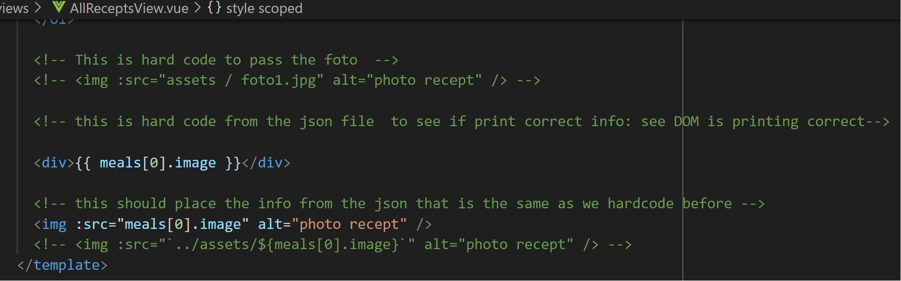
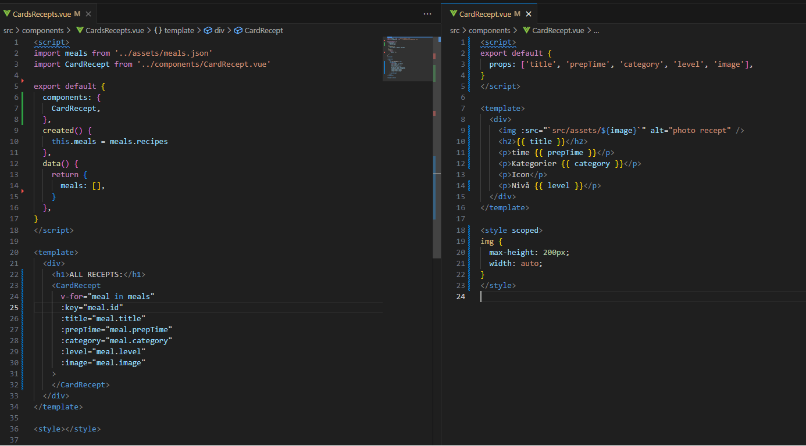
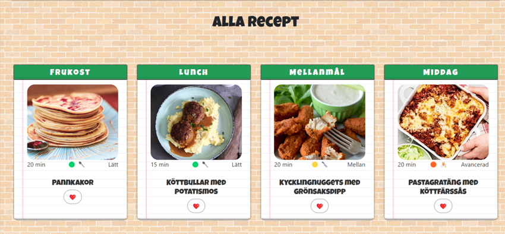
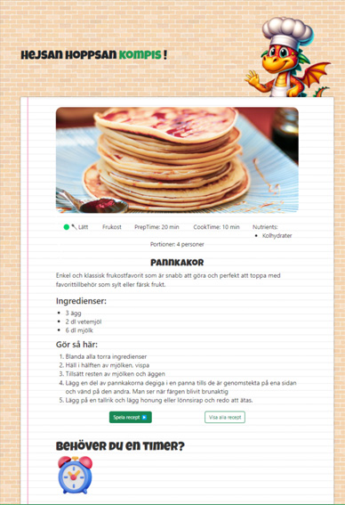
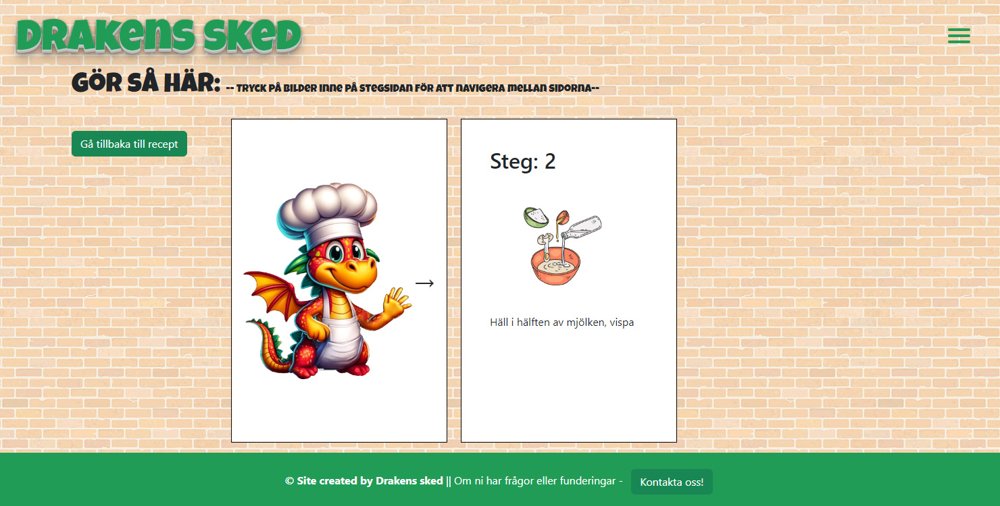

## JavaScript Course with Frameworks: LAB 3

### Individual Report Ursula Vallejo

#### March 2024

---

### Project Link Drakens Sked - Git:

##### [GitHub Drakens Sked](https://github.com/Manouella1/drakens-sked)

- To carry out the project, we first created a **USERFLOW** to determine which parts should be prioritized. Based on that, we designed the layout in Figma. I independently handled the Desktop Wireframes section using the ideas we had agreed upon. You can find the entire project in Figma here:

[WireFrames in Figma](https://www.figma.com/file/upElpjEnRlscQqcmuhCK6G/Wireframes---Drakens-sked?type=design&node-id=16%3A101&mode=design&t=6JAlJMtHBxC33mbE-1)

WireFrames:

[](WireframesDesktop-1)

[](WireframesDesktop-2)

[UserFlow in Figma](https://www.figma.com/file/q0Df0lUQea31K5VLh5Elfp/User-flow---Drakens-sked?type=whiteboard&node-id=0%3A1&t=082raSLQfc3Zq5aI-1)

UserFlow:

[](UserFlow)

Final Resut:


---

- Once we understood the different parts of the project, I took responsibility for structuring what was needed in the project’s setup.
  - I created folders for various resources (`assets`), views (`views`), and fundamental components that we already had or needed.
  - I also implemented the project’s router and a basic navigation menu (`NavBar`) to access each individual section.

Link:
[NavBar, Menu, Routes, Folder Structure, Different Views](https://github.com/Manouella1/drakens-sked/commit/ace49d6e378d27b28039fce82b5325aa2f902e1c)

---

- In the first phase, I sat down and programmed together with Vanessa to see how we best structure the file containing the information we will handle in the project, which is in the file `meal.json`.

* We encountered difficulties when we tried to render from our JSON file to the DOM, where we couldn’t see the image. Everything seemed correctly implemented, but we were stuck for about two hours before asking for help and realizing it was an issue with the image path. We could see an image stored in `assets` when used directly, but when using it dynamically, it did not work. We solved the problem by adding `src/` before the rest of the path.

```javascript
:img-src="`src/assets/receptsbilder/${image}`"
```

What we did at first:

[](imageToDom)

---

- Together with Vanessa, we were responsible for developing the view where the recipes in our project are displayed. For this, I suggested implementing a **Card** component so that we could reuse it. I explained to her how this component would work, and we agreed to implement it. Thus, to see our recipes in the file `AllReceptsView.vue`, we created a **Card** component and another component to display all recipe cards linked together. Hence, in the final view we only use the component: `<CardsRecepts />`.

CardRecept.vue / CardsRecepts.vue Components:

[](Card-cards-componenter)

---

- After the lesson with Jon on Bootstrap, I installed Bootstrap in the project and adapted it to the card components using `<BCard>` and `<BCardText>`.

Later we decided not to use it because we wanted a structure that better suited the project’s layout and created a certain unity. Therefore, we decided to implement a notebook-like background on each recipe card, as well as in the view where all recipe instructions are visible. I took responsibility for implementing this, and we drew inspiration from CodePen. CodePen link:

[CodePen Layout Card/Recipes](https://codepen.io/ursulavallejo/pen/BaEBQdq)

`AllReceptsView.vue` when we can see `CardRecept.vue` components via `v-for` in the array:

[](CardLayout)

`ReceptView.vue`:

[](ReceptLayout)

---

- After completing the view for all recipes, I took care of creating a dynamic router for each individual recipe.

- Later I created a nested router to be able to see each step of the information contained in the instructions, and we wanted the path to change so it would be clear when viewing different information.
  We wanted to see it like this:
  `http:///#/recepts/2/steps`

  It took quite a long time to implement because I wasn’t entirely sure how to do nested routes. Therefore, I consulted the Vue documentation and Stack Overflow. It took a little over a day to get it working.

  Here is how it was implemented in `routes.js`:

```javascript
 {
      component: ReceptView,
      path: '/recepts/:receptId', // Dynamic page ':receptId'
      name: 'Recept',
      children: [ // Nested route
        { path: ':step', component: PlayReceptView, name: 'PlayReceptView' },
      ],
    },
```

In the main list `<AllReceptsView.vue>`, when you click on each recipe card, a dynamic route tied to each individual ID is opened by the dynamic router component `ReceptView.vue`. There you can see detailed information for each recipe (ingredients, image, instructions, etc.). Instead of passing the entire array as props, I decided to create a function that directly searches by ID in the JSON file to access the correct data. Therefore, the card only emits the ID, which is taken as a prop by `ReceptView.vue`, searched directly in the JSON file, and thus each component remains independent and encapsulates its functionality, aligning with the principle of keeping components separated.

I implemented the nested router in `ReceptView.vue` as follows:

```javascript
<!-- without @click, using direct route-link -->
      <router-link
        name="default"
        :to="'/recepts/' + selectedReceptId + '/steps'"
      >
        <BButton variant="outline-secondary" @click="handleClick"
          >Play Recept ▶️</BButton
        >
      </router-link>
    </div>

    <!-- Here we send the JSON information and communicate between Recept and PlayRecept via event to activate the v-if visibility -->
    <router-view
      @handlePlayReceptBack="handlePlayReceptBack()"
      name="default"
      :instructions="selectedMeal.instructions"
    ></router-view>
```

---

- When I implemented the use of ID, I could not render the information in the DOM or console, and it turned out the problem was that ID was treated as a string instead of a number. This prevented correctly locating the object in the JSON array.

```javascript
// We need to access this as a number; if passed as a string it does not work.
const selectedMealId = Number(this.$route.params.receptId)
this.selectedReceptId = selectedMealId

// search in the JSON file by the ID
this.selectedMeal = meals.recipes.find((meal) => meal.id === selectedMealId)
```

---

- After getting `ReceptView` to work and another nested link tied to `PlayReceptView`, I moved on to passing information via props from `Recepts` to view the different steps for each recipe.
  Here we have a button to go back to the previous recipe page. This was where I encountered many difficulties because the recipes were hidden with a `v-if` that, when the steps were activated, became invisible and should be visible again when going back. But the “Go Back” button did not trigger the function to make it visible, and the page did not update; it was as if the component did not reload. I performed multiple debug sessions in both components using `console.log` and implemented, for example, a `mounted` hook to check if everything was working.

  ```javascript
  mounted() {
      console.log('mounted', this.receptId, this.step) // for testing
    },
  ```

  - In conclusion, in the component `ReceptView.vue` I created a function to receive the visibility-change event and also added a watcher to monitor if there was any change in the route to fetch data from the JSON array for that recipe.

`ReceptView.vue`:

```javascript
     handlePlayReceptBack() {
        // Communicate with the other component via router-view
        this.showReceptView = true
        console.log('receptback', this.showReceptView)
      }
    },
    watch: {
      // To solve the issue of not updating data when coming back from PlayReceptView
      $route(to, from) {
        // Verify if the previous and current routes differ
        if (from.fullPath !== to.fullPath) {
          this.loadMealData()
        }
      }
    }
```

Then I encountered difficulties when using the browser’s arrow keys to navigate between `ReceptView` and `PlayRecept`. I had already solved this with the “Go Back” button. When I returned from `PlayRecept` to `ReceptView`, the `v-if` visibility did not update (nothing was shown), and when I did the reverse from `ReceptView` to `PlayReceptView`, both sections appeared (`v-if` for recipes did not hide). I solved this by implementing a watcher with different `if` conditions depending on which route is active, logging to the console when triggered. Here is an example:

```javascript
// Check if the current route corresponds to Recept/id
if (to.name === 'Recept' && to.params.receptId) {
  this.handlePlayReceptBack()
  console.log('inside back browser')
}
// Check if the current route corresponds to steps
if (to.name === 'PlayReceptView') {
  this.handleClick()
  console.log('inside fwd browser')
}
```

Then, when I was on the `PlayRecept` page and refreshed the browser, all information reloaded without hiding the `v-if` for the recipe. At that point, I thought I could create another `if` inside the watcher, but it didn’t work for me. After research and reflection, I solved it by implementing that `if` condition in `mounted`, and that fixed the issue:

```javascript
mounted() {
      // Check if the current route corresponds to PlayReceptView
      if (this.$route.name === 'PlayReceptView') {
        this.handleClick()
        // console.log('inside page load or reload')
      }
    }
```

---

- On the `PlayRecept` page, the idea was to visualize the different steps of the recipe one by one. Initially, we considered using a dynamic router, but we did not want to split it into multiple components, so I did not implement that. Then the idea was to have a modal with buttons to navigate back and forth between the steps. The concept was to iterate over elements in an array. After group discussion, we decided it would be more fitting from a design standpoint to have a book-like layout where pages could be turned through.

By that point, I started looking for book ideas on CodePen and found an implementation that could be helpful. Here is the link:

[CodePen book](https://codepen.io/ml394/pen/LBjqBE)

`PlayRecept.vue`:

[](Play-recept)

To include it in our project, I organized the book logic in the function `setupPageInteraction()`, and to activate that functionality I used the `mounted` hook:

```javascript
   mounted() {
      this.setupPageInteraction()
    },
```

The function `setupPageInteraction()` runs as soon as the component is mounted. This makes it the perfect place to initialize and configure logic or interactions related to the page or specific DOM elements.

---

In Sprint 2, during our group meeting, we decided to restructure responsibilities because several teammates felt my programming contributions were broader than others’. Therefore, in this phase, I focused on debugging issues in the `PlayRecept` component that were not fully functional. We also emphasized making recipes and other parts of the project more responsive.

- I fixed it in `PlayReceptView` by only showing the video link if it was provided in the data array, using a `v-if` to solve it:

```javascript
     <a
                v-if="instruction.video"
                :href="instruction.video"
                target="_blank"
                >Watch Video</a
              >
```

- In `PlayRecept`, I implemented media queries for three types of devices because the book we implemented uses `position: absolute` and doesn’t reposition based on percentages. Therefore, we needed separate media queries to correctly position it on mobiles, iPads, and desktops (small and large screens).

- In our `meal.json`, images were missing for each step of every recipe (we created 20 IDs), so I had to search for images for each individual recipe step and edit each ID. I looked for images that fit the aesthetic of the layout and used Photoshop to adjust and edit them in many cases. This took nearly two days of work, including finding a related video for each recipe.

- For `PlayRecept`, I also created a Drake GIF to use in the recipe book:


- **GitHub Collaboration**:
  In the project, I tried using Git branches to create the components that belonged to me, but several team members were not comfortable with using branches and experienced difficulties doing `git pull` on multiple occasions. Therefore, we decided that everyone would work on `main` and I deleted my branch. To avoid conflicts in Git, we created a Discord channel for the project where we informed the team about our work and whenever we performed a `git push`. This allowed us to maintain a functioning system.

[git Branch Ursula](https://github.com/Manouella1/drakens-sked/tree/69d879047e4b0f09602ae0db37e214fdd376772f)

In conclusion, I believe it has been a very valuable experience to work in a team and adopt an agile model to understand what it is like to collaborate, solve obstacles more clearly, and have a defined workflow to clarify tasks, their requirements, and completion criteria.

Regarding the technical development aspect, I think that encountering and solving problems while considering the best implementation solutions helps understand how everything relates. In the first individual project, I struggled to understand how Vue components relate to each other, but in this group project, I felt much more comfortable and confident working with Vue. I believe I have learned a lot from this work and have researched extensively to gain a deeper understanding, especially regarding topics like routing and updating page information based on the current route.

There are things we could have implemented better with more time, such as adding Drake’s voice in `PlayRecept`, but overall, I believe everyone is satisfied with the work done. Personally, if I were to do the project again, I would try to find a better, more responsive solution for `PlayRecept` or explore a different layout approach.

```

```
