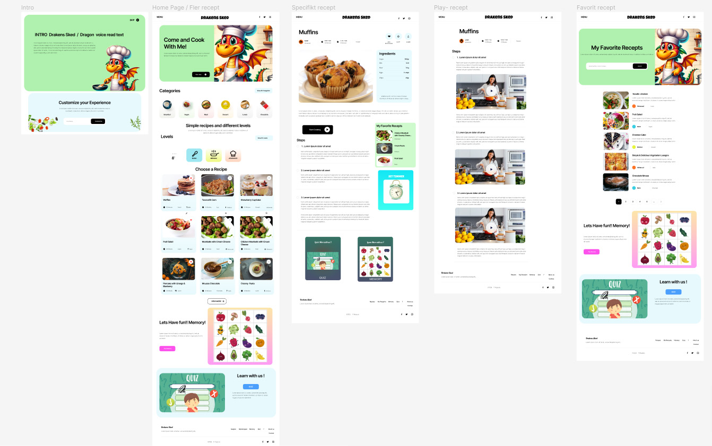
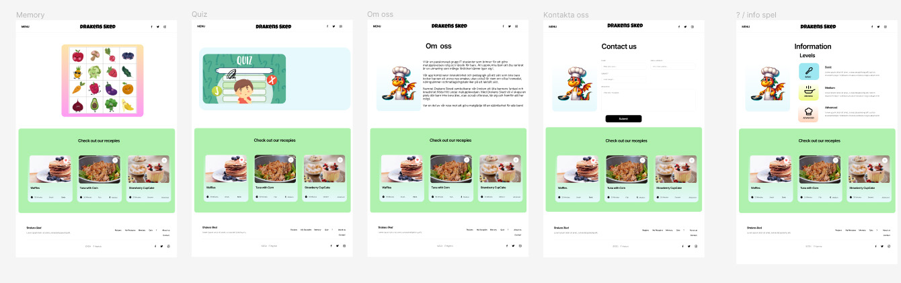
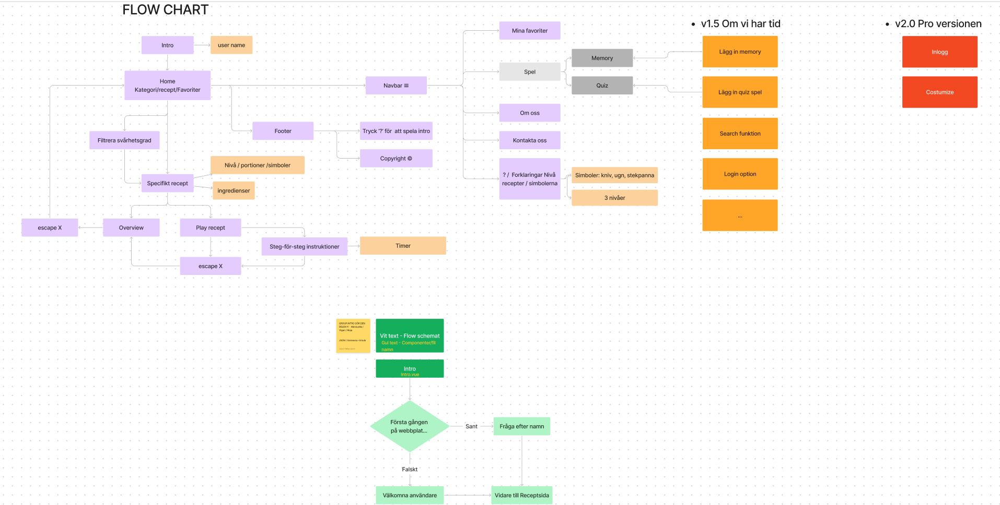

#### March 2024

**Project Summary**

“Drakens Sked” is a Vue 3 single-page application built with Vite that functions as a dynamic recipe browser. Users can explore a grid of recipe cards loaded from a local JSON file (`meal.json`), click into individual recipes to see ingredients and instructions, and navigate step-by-step through each recipe via a flip-book–style interface. The project was developed in the context of a JavaScript with Frameworks course (LABB 3) and followed an agile, collaborative workflow.

Users can view detailed ingredients and instructions, then flip through each recipe step in a book-like interface.

Two nutrition-based mini-games:

A Quiz on food and nutrition

A Memory game matching food images or ingredients

Multi-criteria filtering (e.g., “Easy” + “Lunch”)

Persisted user data: saves initial username and favorite meal in localStorage


https://github.com/user-attachments/assets/1f1f6abd-98bd-495d-95cf-f8888bdadfff


---

### 🛠️ Technologies Used

- **Vite** – Fast build tool and development server with hot module replacement.
- **Vue 3** – Reactive JavaScript framework (Composition API and Options API) for building the SPA.
- **Vue Router (v4)** – Client-side routing with dynamic and nested routes (`/recepts/:receptId/steps`).
- **JavaScript (ES6+)** – Core language for application logic, data parsing, and component scripts.
- **Sass (SCSS)** – CSS preprocessor for nested rules, variables, and mixins.
- **CSS3 & Media Queries** – Responsive styling to adapt layouts for mobile, tablet, and desktop.
- **Local JSON Data** – `meal.json` file containing recipe objects (name, ingredients, steps, images).
- **Bootstrap (initially)** – Used for card components (`<BCard>`, `<BCardText>`), later replaced by custom CSS.
- **Howler.js** – (Included; available for audio playback if needed)
- **jQuery** – (Included for optional DOM utilities)
- **ESLint & eslint-plugin-vue** – Linting and code-style enforcement for Vue components and JavaScript.
- **Git & GitHub** – Version control, branching workflow, and team collaboration.
- **Figma** – Design tool used for creating wireframes and user-flow diagrams before implementation.
- **Media Assets** – Custom recipe images, step illustrations, and a Drake GIF integrated into the flip-book interface.

---

### General view:

WireFrames:

[](WireframesDesktop-1)

[](WireframesDesktop-2)

UserFlow:

[](UserFlow)

---

### 🔧 Installation and Usage

1.  **Clone or download** the project folder

    ```bash
    git clone <your-repo-url>
    cd <project-folder>
    ```

2.  **Install Dependencies**

    ```bash
    npm install
    ```

3.  **Run in Development Mode**

    ```bash
    npm run dev
    ```

    - The app will be available at `http://localhost:5173` (or the port shown by Vite).
    - Enter your name on load and start exploring the app.

---

### 📄 [Detailed Information of the Project](Detail_Info.md)

---

### 📝 Additional Notes

1. **Planning and Initial Design**

   - **User Flow**: Before writing any code, a user flow was created in Figma to visualize screens and navigation paths, helping the team prioritize essential features (recipe list, detail view, step-by-step viewer).
   - **Wireframes**: High-fidelity desktop wireframes were designed in Figma to show the main recipe grid, the detail page, and the “Play Recipe” flip-book interface. These wireframes guided implementation and aligned the team on structure and layout.

2. **Project Structure and Folder Organization**

   - A `assets/` folder was created for recipe images (step-by-step illustrations, thumbnails, and a Drake GIF).
   - Views reside in `views/`:
     - `AllReceptsView.vue` (displays all recipes).
     - `ReceptView.vue` (details for a single recipe).
     - `PlayReceptView.vue` (flip-book interface for navigating instructions).
   - Reusable components were placed in `components/`:
     - `CardRecept.vue` (a standalone recipe card component that accepts props).
     - `CardsRecepts.vue` (wrapper that loops through the recipes array and renders multiple `CardRecept` components).
     - Other shared components: `NavBar.vue`, `Reviews.vue` (user information panel), `Loader.vue`, etc.
   - `router/routes.js` contains the Vue Router configuration, including nested routes that allow URLs like `/recepts/2/steps`.

3. **Iterative Development and Key Responsibilities**

   - **Structure & Routing Lead**:
     - Set up the initial folder structure and installed dependencies (Vite, Vue, Vue Router, ESLint, Sass).
     - Created the base navigation with Vue Router and implemented the navigation bar (NavBar) for accessing each section.
   - **Recipe List Implementation**:
     - Loaded `meal.json`, filtered out any recipes missing a valid image, and displayed the first 15 items in `AllReceptsView`.
     - Used `<CardsRecepts />` to render a `<CardRecept v-for="...">` for each recipe.
     - Solved a bug where dynamic image paths failed: prefixed each URL with `src/assets/` so `:img-src=" \`src/assets/receptsbilder/${image}\`"` worked correctly.
   - **Recipe Detail View (`ReceptView.vue`)**:
     - Configured a dynamic route `/recepts/:receptId` capturing the `receptId` param. Converted it from string to Number to locate the correct recipe object:
       ```js
       const selectedMealId = Number(this.$route.params.receptId)
       this.selectedRecept = meals.recipes.find(
         (meal) => meal.id === selectedMealId
       )
       ```
     - Displayed fields such as name, image, ingredient list, and overall instructions.
     - Added a “Play Recipe” button that links to the nested route `/recepts/:receptId/steps`.
   - **“Play Recipe” Mode with Nested Routing (`PlayReceptView.vue`)**:
     - Defined in `routes.js`:
       ```js
       {
         path: '/recepts/:receptId',
         component: ReceptView,
         children: [
           { path: 'steps', component: PlayReceptView, name: 'PlayReceptView' }
         ]
       }
       ```
     - Navigating to `/recepts/2/steps` mounts `PlayReceptView` on top of `ReceptView` without reloading the parent view.
     - Resolved reactivity and visibility issues:
       - A `v-if` in `ReceptView` wouldn’t toggle when using the browser’s back button, so a watcher on `$route` was added to detect route changes and adjust visibility:
         ```js
         watch: {
           $route(to, from) {
             if (from.fullPath !== to.fullPath) {
               this.loadMealData();
             }
           }
         }
         ```
       - In `mounted()`, checked if the current route is `PlayReceptView` after a page reload and triggered the flip-book start logic:
         ```js
         mounted() {
           if (this.$route.name === 'PlayReceptView') {
             this.startBookAnimation();
           }
         }
         ```
   - **Flip-Book Interface**:
     - Based on a CodePen implementation, a flip-book module was integrated. The function `setupPageInteraction()` is called in `mounted()` to configure click and keyboard events for page turning.
     - Custom media queries ensure the book stays centered and legible on mobile, tablet, and desktop.
   - **Debugging & Optimization**:
     - Conditional display of video links: only show “Watch Video” if `instruction.video` exists (`v-if="instruction.video"`).
     - Adjusted Sass styles and media queries for fluid, responsive layouts.
     - In Sprint 2, focused on reactivity issues when navigating between routes via UI buttons and browser navigation arrows. Added watchers to handle `to.name === 'Recept'` and `to.name === 'PlayReceptView'`, triggering the correct visibility toggles.

- **localStorage usage**: The application checks localStorage on mount to auto-fill username and favorite meal. If these keys
  (userName and favoriteMeal) exist, the user is greeted and the favorite meal filter is pre-selected.

- **Filtering logic**:

  FilterPanel.vue uses v-model for selectedDifficulties and selectedMealTypes.

  A computed property filteredRecipes returns only recipes matching all active filters.

- **Game assets**: Quiz questions and memory card images are stored locally in src/assets/games/.

- **Flip-book library**: The logic in PlayReceptView.vue calls setupPageInteraction() on mounted() to create the book-like page-turn experience, with custom CSS media queries for mobile, tablet, and desktop.

4. **UX/UI Highlights**

   - **Notebook-Style Design**: Each recipe and each instruction page render over a notebook-like background (inspired by a CodePen), reinforcing the feel of a digital cookbook.
   - **Responsive Design**:
     - Breakpoints for mobile (<600px), tablet (600–1024px), and desktop (>1024px).
     - The flip-book component repositions and resizes based on screen size to avoid horizontal scrolling.
   - **Progressive Loading**: In views with many images, a `Loader.vue` spinner appears while resources load, preventing UI blocking.
   - **Immediate Feedback**:
     - Clicking “Play Recipe” triggers a page-turn animation.
     - The “Go Back” button returns to the recipe detail view without unmounting the parent, using watchers and custom events to re-show the hidden section.

5. **Workflow and GitHub Collaboration**

   - The team initially planned to work with feature branches but switched to working directly on `main` to avoid frequent merge conflicts.
   - A Discord channel was used for real-time communication: each team member announced when they pushed changes.
   - Despite occasional `git pull` issues, the team maintained a stable codebase with clear coordination on commits and pushes.

6. **Technical Challenges and Solutions**

   - **Dynamic Image Imports from JSON**: A path error was fixed by prepending `src/assets/` to each image URL in the JSON.
   - **Nested Routing & Reactivity**:
     - Browsing between parent (detail) and child (steps) routes without fully remounting the parent and retaining view state was tricky.
     - Combined watchers on `$route`, custom events (`handlePlayReceptBack`), and checks in `mounted()` to manage visibility toggles.
   - **Media Queries for Flip-Book**: Because the flip-book used `position: absolute`, dedicated CSS rules were needed to position pages correctly on mobile, tablet, and desktop.
   - **Missing Images in JSON**: For 20 step IDs with no images, two days were devoted to sourcing, editing, and optimizing each step image in Photoshop, matching the project’s aesthetic.
   - **Multimedia Adaptation**:
     - Integrated a Drake GIF in the flipping book to reinforce a playful style.
     - Conditionally showed video links only if `instruction.video` was provided.

7. **Outcomes and Learnings**

   - **Web Service Calls**: Although the data source is local JSON, the team demonstrated data parsing and dynamic rendering.
   - **Text Interpolation & Attribute Binding**: Extensive use of `{{ }}`, `v-bind:src`, and `:to="{ }"` for dynamic URLs.
   - **Conditional & List Rendering**: Used `v-if` and `v-for` to render recipe lists and instruction steps.
   - **Event Handling & v-model**: Employed form inputs, click handlers, and two-way binding for any search or user inputs.
   - **Vue Router with Dynamic & Nested Routes**: The `/recepts/:receptId/steps` structure demonstrates mastery of dynamic and nested routing.
   - **Props & Computed/Watch**: Components receive typed props; computed properties format data; watchers on `$route` trigger data reloads.
   - **Custom Events**: Emitted `handlePlayReceptBack` events between child and parent to toggle views.
   - Creating wireframes and user flows in Figma helped the team clarify the app’s architecture before coding.
   - Gained real-world experience collaborating in a team, resolving Git conflicts, and maintaining a stable main branch.
   - Deepened understanding of Vue Router, dynamic routes, local data handling, watchers, and component reusability.

8. **Next Steps and Future Improvements**
   - **Search & Filter**: Add a live search/filter feature by recipe name or ingredient using `v-model` and watchers.
   - **Remote Data Persistence**: Replace `meal.json` with a real backend API (e.g., Firebase or a custom REST endpoint) to store recipes and user comments.
   - **User Comments**: Implement a comments section per recipe, storing data in `localStorage` or a backend.
   - **Accessibility & Testing**: Write unit tests with Jest and end-to-end tests with Cypress. Enhance accessibility (ARIA labels, keyboard focus).
   - **Performance Optimization**: Lazy-load images and implement code-splitting to speed up initial load times.
   - **Internationalization**: Add support for English and Swedish to accommodate a broader audience.
   - **Responsive Flip-Book**: Investigate a more flexible flip-book library that doesn’t rely on absolute positioning to improve responsiveness on all devices.
